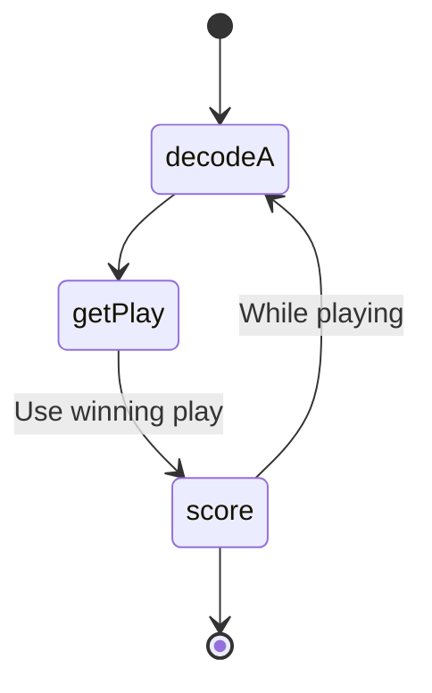
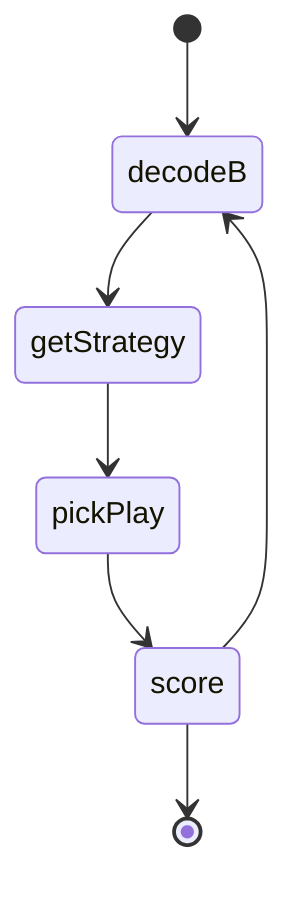

# Advent of Code

This is the place to keep all answers for Advent of code.

Written in Typescript using Deno as a runtime for ease of use.

The rest will be a mini journal of the days. I do not expect to have time to
finish all puzzles this year, but we will see how far we get before family and
responsibilities catchup.

# 2022

## Day 4 :page_with_curl: 🔍 ⛏️

> This was a really easy puzzle. It was a rare puzzle that the second one was
> very easy once the first was done. Since it was so easy, I decided to make
> some changes to day2 typing to see if it was more clear. I am not sure it is,
> but, it is better typed now.

## Day 3 🔐

> This puzzle was not very hard but I am very unhappy with the complexity of the
> solutions. There are a lot of iterations over small arrays. While this should
> be okay, it is something that I would rather simplify.

## Day 2 🪨🗞️✂️

> This puzzle part 1 was fairly easy. But part 2 confused me a bit. It made me
> have to carefully evaluate the wins and loss strats and the point values.
> Also, deno complaining about indexing into the object type is something that I
> want to look closer at. The typing on this is fairly messy, but its late and I
> just want to be finished with it. :)

### Puzzle A

### Puzzle B

## Day 1

> Day 1 puzzles are always very easy warm ups. This was no exception. I was a
> little rusty on little things like sorting numbered arrays, but it was fairly
> straight forward.

## Setup

> Setup of Deno was surprisingly easy and without many issues. There was an odd
> module not found error that cleared itself and debugging took a minute to
> setup. However, to run these simple code snippets, Deno is great.

## TODO

- [ ] Create a visual for Day3. Reddit has some great examples.
- [ ] Create a dashboard readme that has a task run before committing to update.
- [ ] Use a python for one puzzle
